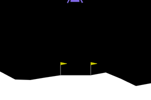
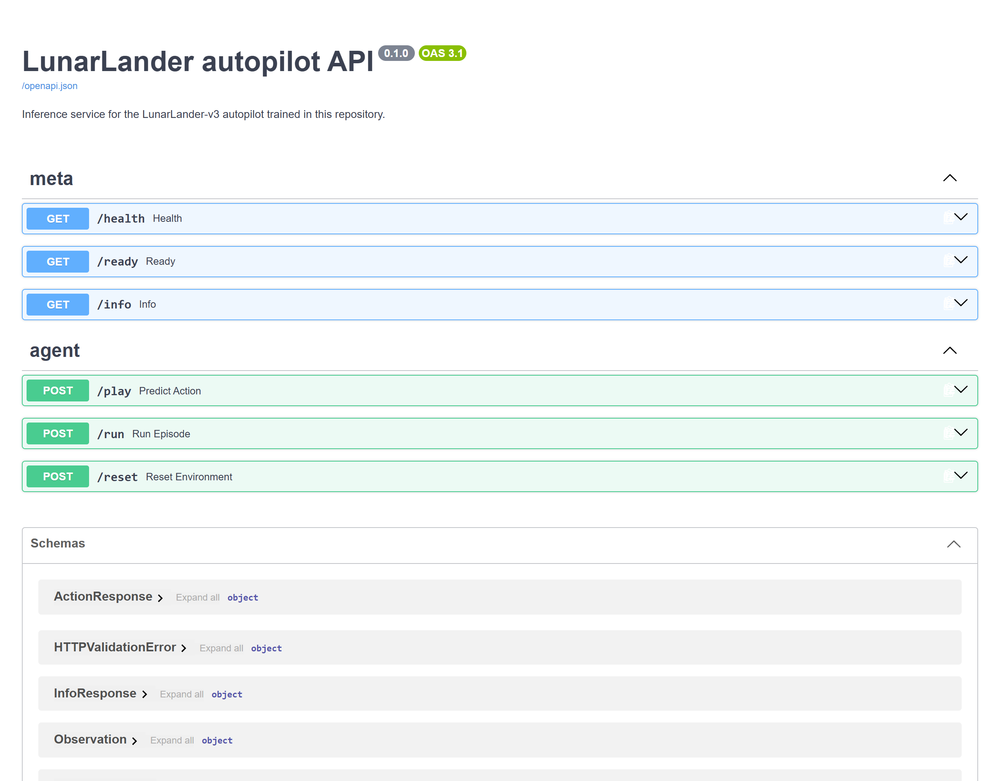
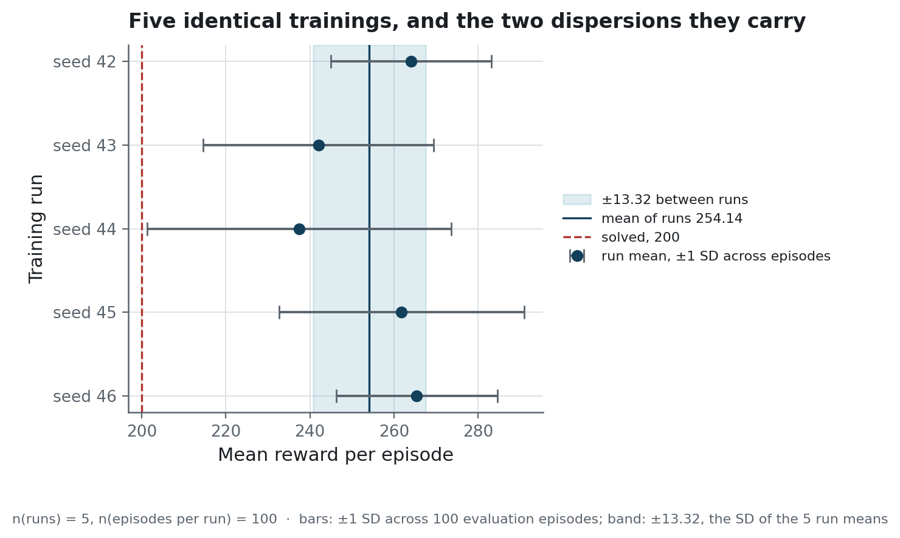
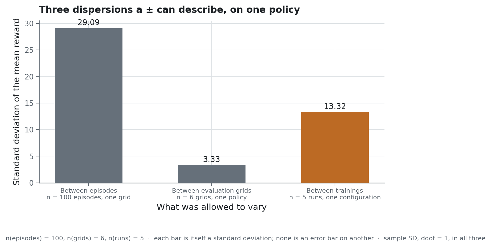

<h1 align="center">Lunar Lander</h1>

<p align="center">A PPO autopilot whose published score is measured across five independent trainings, not one</p>

<p align="center">
  
  
  
  
</p>

<!-- source: docs/images/MANIFEST.json -->
<p align="center">
  
</p>

**Project status** — frozen, and still runnable. Every number below is read from a tracked
file under `reports/`, written by a script under `scripts/`, and nothing is redrawn by hand.
The workflows lint, scan and test on every push; they train nothing, because the policy that
is published is the checkpoint committed here.

## The problem

Landing the lander is the easy half. Any competent PPO configuration clears Gymnasium's
solved threshold of 200 in about a million steps, and this one does.

The hard half is the number you then publish. Three things move it, `docs/protocol.md` names
them, and the usual practice fixes two and varies the third in silence: one run, one grid, and
a standard deviation that describes the episodes. Retrain the same configuration and you get a
different number. The published one was never about the configuration at all.

So the question this repository is built around is **what a LunarLander score is a claim
about, and which of those three the dispersion beside it describes.**

## What it does

A FastAPI service loads the shipped policy and plays episodes on request: `/play` for one
action, `/run` for a full trajectory with its rewards and its seed. Both contracts are
Pydantic models, so the documentation page below is generated from what the service
validates against.

<!-- source: docs/images/MANIFEST.json -->


`/health` and `/ready` are separate on purpose: one means restart the process, the other means
stop sending it traffic. `docs/architecture.md` gives the failure that follows from merging
them.

A Streamlit cockpit replays an episode the API ran.

<!-- source: docs/images/MANIFEST.json -->


It asks the API for a trajectory and rebuilds the frames locally — a thousand 600×400
frames over HTTP would be a bill, not a design. That is only legitimate if the replay is
the same episode, so the page compares its replayed rewards against the API's and says so
when they differ.

A second Streamlit surface reads the published evaluation.

<!-- source: docs/images/MANIFEST.json -->


Alongside them, `src/rl_lander/exercises/` holds the three steps the agent was built on:
a random policy, tabular Q-learning, and a DQN written out by hand.

### How it is built

The agent is **Stable-Baselines3** PPO on **PyTorch**, trained against **Gymnasium**'s
`LunarLander-v3` with Box2D underneath. One million steps per run, on the CPU, because the
library had been saying all along that a PPO with an MLP policy belongs there: 50 000 steps in
14.9 s against 20.3 s on an RTX 4060 Ti. DQN is the other way round, and each algorithm now
names its device with the measurement beside it.

**FastAPI** serves the policy and **Uvicorn** runs it. The two **Streamlit** pages hold no reinforcement learning at
all: one asks the service for a trajectory and rebuilds the animation locally, the other reads
the published exports and draws them with **Plotly**, on the colours the figures use.

**uv** holds the environment to its lock file, **Ruff** and **Bandit** run on every push, and
**pytest** is read by tier: unit, integration, and one outer tier that boots `uvicorn` and asks
the running service to fly one seed twice. **Docker** ships the service and the dashboard as
one image, on the CPU build of PyTorch.

## The result

Five PPO runs, identical hyper-parameters, seeds 42 to 46, one million steps each. Every run
scored the same way, on n = 100 episodes of a fixed evaluation grid, through the same code the
exporter uses. `docs/protocol.md` defines every column below and says which population each
dispersion covers.

<!-- source: reports/seed_study.json -->
| Training run | n | mean_reward | sd_across_episodes | landing_rate | threshold_rate | worst_episode |
|---|---|---|---|---|---|---|
| seed 42 | 100 | 264.05 | 19.13 | 1.00 | 1.00 | 217.51 |
| seed 43 | 100 | 242.03 | 27.41 | 0.97 | 0.97 | 111.52 |
| seed 44 | 100 | 237.43 | 36.09 | 0.98 | 0.96 | **−33.38** |
| seed 45 *(shipped)* | 100 | 261.80 | 29.09 | 0.97 | 0.97 | 122.78 |
| seed 46 | 100 | 265.39 | 19.20 | 1.00 | 1.00 | 224.65 |

<!-- source: reports/seed_study.json -->
**254.14 ± 13.32 between runs**, over n = 5 trainings, worst 237.43, five of the five above
the solved threshold of 200. That is the transportable number: retrain this configuration and
you land somewhere in that range.

<!-- source: reports/figures/MANIFEST.json -->


The shipped policy is the one trained at seed 45, chosen because its mean is nearest the median
of the n = 5, and not because it is the best. `scripts/publish_run.py --from-study` makes that
choice, so it is a rule and not a judgement made after seeing the scores.

Its own evaluation, on six independent seed grids of n = 100 episodes each:

<!-- source: reports/evaluation_summary.json -->
| Evaluation grid | n | mean_reward | sd_across_episodes | worst_episode | landing_rate |
|---|---|---|---|---|---|
| grid 2024 *(exported)* | 100 | 261.80 | 29.09 | 122.78 | 0.97 |
| grid 7 | 100 | 266.52 | 20.27 | 224.37 | 1.00 |
| grid 99 | 100 | 269.57 | 20.38 | 226.51 | 1.00 |
| grid 123 | 100 | 269.08 | 20.98 | 223.12 | 1.00 |
| grid 555 | 100 | 264.31 | 22.22 | 154.11 | 0.99 |
| grid 31337 | 100 | 262.34 | 23.64 | 135.41 | 0.99 |

<!-- source: reports/evaluation_summary.json -->
**265.60 ± 3.33 across grids**, over six grids of n = 100 episodes. The mean is stable to
about a point; the worst episode moves from 123 to 227, and the landing rate from 97 of 100 to
100 of 100. The exported grid is the *least* flattering of the six. That is not a virtue: it
is what happens when the grid is chosen by code, in advance, and not after the numbers are
in.

Read the two spreads together and they answer the question at the top. The dispersion between
n = 5 trainings is four times the dispersion between n = 6 evaluation grids of one policy, and
the variance that matters is the one the usual report leaves out.

<!-- source: reports/figures/MANIFEST.json -->


### Against DQN, at an equal budget

<!-- source: reports/seed_study.json -->
| | n | mean_reward | sd_across_episodes | landing_rate | worst_episode | episode_length |
|---|---|---|---|---|---|---|
| PPO, mean of 5 runs | 500 | 254.14 | 13.32 between runs | 0.984 | not applicable | not applicable |
| PPO, shipped run | 100 | 261.80 | 29.09 | 0.97 | 122.78 | 322.6 |
| DQN, 1 run | 100 | **271.13** | 47.51 | 0.96 | 34.41 | 212.2 |

One million steps each, not the 200,000 DQN's own defaults suggest, because a comparison at
unequal budgets measures the budget. The DQN scores higher on the mean and is worse
everywhere else that matters: its episode spread is 47.5 against 19–36 for the PPO runs,
its worst episode is 34.4 against 122.8, and it is **one seed against five**. What can be
said is that DQN is competitive on this task at this budget, and that nothing here supports
ranking the two.

### What the hyper-parameters are worth

One parameter changed at a time, same budget, same evaluation protocol, n = 100 episodes
each.

<!-- source: reports/hyperparameter_trials.csv -->
The baseline row is the mean of the five seeds, whose standard deviation between runs is
13.32; every other row is one training.

| Trial | n | mean_reward | delta_vs_baseline | Larger than the seed spread? |
|---|---|---|---|---|
| baseline, 5 seeds | 500 | 254.14 | reference | reference |
| `learning_rate=1e-3` | 100 | 267.73 | +13.6 | just barely |
| `n_steps=2048` | 100 | 210.06 | −44.1 | yes |
| `gamma=0.99` | 100 | 173.13 | −81.0 | yes |

The last column is what makes the table readable. Each trial is a **single** seed, and the
baseline's own spread between seeds is 13.32. A difference smaller than that is one draw from
the same distribution, not evidence about the parameter. So `n_steps=2048` and `gamma=0.99` are
real effects, and `gamma=0.99` does not clear the solved threshold at all, at 173.13 with a
landing rate of 0.73. `lr=1e-3` clears the spread by three tenths of a point and establishes
nothing. Publishing `lr=1e-3` as the winner would put a 0.3-point gap on the page as a
finding, which is what the first version of this repository did with its own ± 18.2.

## Why these numbers can be believed

One collection feeds everything. `scripts/evaluate_and_export.py` scores the policy once,
and the CSV, the summary, the dashboard and every number on this page read that one run.
Beside it, `reports/evaluation_manifest.json` records which checkpoint was scored, on which
grids, with which library versions and at which revision. `docs/protocol.md` defines every
column of every table and says which population each dispersion covers.

A run becomes the shipped policy by rule and never by eye. `scripts/publish_run.py
--from-study` promotes the median of the five, refuses a run no evaluation ever improved on,
and its docstring holds the rule and its tie-break.

### What the tests assert

Not that the code runs. That the published claims are true:

- the exported CSV and the published summary are **one** collection: same episode count,
  same mean, same standard deviation, same landing rate;
- every exported row carries the seed that replays it, and those seeds are the grid the
  summary names;
- the manifest points at a policy that exists in the repository, by a relative path;
- the solved-threshold claim holds on **every** evaluation grid, not only the exported one;
- `scripts/evaluate_and_export.py` exits non-zero when a grid falls short, so a claim cannot
  outlive the run behind it.

Warnings are errors (`filterwarnings = ["error"]`), with three exemptions that each name the
message they silence and come from a dependency. That paid for itself on the first run: a
library warning the old configuration had been swallowing turned out to be right about which
device each algorithm belongs on. PPO trains faster on the CPU here than on the card; DQN is
the other way round, and the two measurements that settled it are in the comments beside the
device fields of `training/hyperparameters.py`.

### What was wrong before, and by how much

This repository used to report `262.2 ± 18.2`, taken from one run on its most favourable
evaluation grid, as though the ± described the method. Re-reading what had been published
turned up seven defects, and rebuilding the study found two more. All nine were in what was *published*
rather than in what was computed, and each is given here with the number before and the
number after, because a correction nobody can see is half a correction.

**The file called `best` held the last model.** `EvalCallback` wrote its best checkpoint to
`models/best_model.zip`; then `model.save(output)` wrote the state training *ended* on, under
the name that was tracked and published. Both algorithms pointed at that one directory, and
`--output` defaulted to the PPO path whatever `--algo` said.

Both checkpoints are kept now, so `scripts/compare_checkpoints.py` can price the defect on
the exported grid of n = 100 episodes:

<!-- source: reports/checkpoint_comparison.csv -->
| Run | Checkpoint | n | mean_reward | landing_rate |
|---|---|---|---|---|
| PPO, seed 45 | `best.zip` | 100 | 261.80 | 0.97 |
| PPO, seed 45 | `final.zip` | 100 | 268.14 | 1.0 |
| DQN, seed 42 | `best.zip` | 100 | **271.13** | 0.96 |
| DQN, seed 42 | `final.zip` | 100 | **−610.34** | 0.0 |

<!-- source: reports/checkpoint_comparison.csv -->
The DQN policy at the end of training lands **0** of its n = 100 episodes where its best
checkpoint lands **96**. On that run the repository would have shipped a policy that never
lands. For PPO the same defect cost about six points in the other direction, which is why it
survived: on the algorithm that was shipped, it was almost free.

**Landing was read from the score.** `evaluate.py` set `landed = total_reward >= 200`, and
200 is a statement about the task over many episodes. The environment answers directly, in
the sign of the reward it pays on termination.

<!-- source: reports/seed_study.json -->
On the shipped policy the two agree, at a landing rate of 0.97 and a threshold rate of 0.97
over n = 100 episodes, which is why the confusion was invisible. Across the five trainings
they do not: seed 44 lands **0.98** of its episodes and clears 200 on **0.96**.

**Two official means, in the same file.** `evaluation_summary.json` carried 261.394 at its
root and 262.218 under `metrics`, with standard deviations 44% apart: two evaluation loops
with different reset semantics, both published, neither designated as the result.

**One evaluation grid, published as the performance.** The old export ran seed 2024 alone and
did not say so. On six grids, its published standard deviation of 18.2 was the lowest of the
six against a median of 23.3, and its 100% landing rate was a property of that grid, the
worst episode elsewhere being 63.0 against the 222.5 on record.

**The exports carried no provenance.** No checkpoint path, no seed list, no versions, no
revision: a reader could not tell which model had produced the numbers, nor re-run it. The
manifest described at the top of this section is what replaced that silence.

**The structure section described a tree that did not exist.** It listed directories the
repository did not have and omitted three it did. `tests/integration/test_deliverables.py`
now compares the section against the tracked tree, so the page cannot drift from the disk
again.

**`fuel_used` counted one engine in three.** It summed the main engine only, so a policy that
hovered on its side thrusters looked frugal. Two counters replaced it, main and side, and
both are columns of every exported episode.

**One training run, published as the method.** Everything above concerns evaluation
conditions with the model held fixed. The variance that matters in reinforcement learning,
between two trainings identical but for the seed, was not measured at all. It is the first
table on this page: 237.43 to 265.39, a 28-point range against the single ±18.2 offered as
the only uncertainty.

**A hyper-parameter study that did not exist.** The notebook carried a table of four
approximate figures, `~280`, `< 200`, `~270`, `~240`, and a conclusion drawn from it. None of
those numbers existed anywhere else in the repository, and the evidence it cited, TensorBoard
logs, is ignored by git. Measured, not one row was right, and the ranking is inverted: the
table put the baseline first and `lr=1e-3` last, where the measurement puts `lr=1e-3` first
and the baseline second.

**The DQN baseline was announced and never delivered.** `models/` was described as holding
"best PPO / baseline DQN". It held only the PPO, and the notebook discussed a baseline as
though it existed. It is trained, scored and published above.

One last defect, which no linter and no warning sees: read as a fallback, a slot descriptor
travelled through the constructor of the hyper-parameters without complaint and failed
minutes into a run, inside Stable-Baselines3's loop.
`tests/unit/training/test_training_artifacts.py` pins it, and says what to read it as.

## Running it

```powershell
uv sync --all-extras
```

Go straight to the surfaces, on what is committed:

```powershell
uv run uvicorn rl_lander.api:app                        # http://127.0.0.1:8000/docs
uv run streamlit run src/rl_lander/gui.py               # one episode, animated
uv run streamlit run src/rl_lander/dashboard.py         # the evaluation run, filtered
uv run python -m rl_lander.record_video                 # var/videos/landing.mp4
```

Or without installing anything but Docker, for the two that are served:

```powershell
docker compose up --build    # the API on :8000, the dashboard on :8501
```

One image for both, 2.0 GB of which the CPU build of PyTorch is most. The cockpit is not in
it: it animates an episode it replays itself, and `docs/operations.md` says what that costs
in a container.

Or reproduce the study — nine trainings, resumable, about three hours on one machine:
roughly 14 minutes per PPO run on an idle CPU, 40 for the DQN.

```powershell
uv run python scripts/train_study.py              # 5 PPO seeds, 3 trials, 1 DQN at equal budget
uv run python scripts/aggregate_study.py          # the three artefacts under reports/
uv run python scripts/publish_run.py --from-study # promotes the median run
uv run python scripts/evaluate_and_export.py      # re-scores it, and states a verdict
```

Six documents sit behind this page: [`docs/architecture.md`](docs/architecture.md) for why a
service and where the boundaries are, [`docs/protocol.md`](docs/protocol.md) for how each
number was measured, [`docs/data-source.md`](docs/data-source.md) for what the environment is
and what a seed fixes, [`docs/operations.md`](docs/operations.md) for running the service,
[`docs/interface.md`](docs/interface.md) for the two pages, and
[`notebooks/lunar_lander.ipynb`](notebooks/lunar_lander.ipynb) for the work in order,
exercises included.

## Structure

```
├── reports/                      # everything published
│   ├── evaluation_episodes.csv   #   the canonical collection, one row per episode
│   ├── evaluation_summary.json   #   its metrics, and the spread across evaluation grids
│   ├── evaluation_manifest.json  #   model, seeds, package versions, git revision
│   ├── seed_study.json           #   the five trainings, and the DQN at equal budget
│   ├── hyperparameter_trials.csv #   one row per single-parameter trial
│   ├── learning_curve_band.csv   #   median and interquartile range across the five
│   └── training_curves.csv       #   the shipped run's own curve
├── docs/
│   ├── architecture.md           # why a service, and where the boundaries are
│   ├── data-source.md            # the environment, the seeds, and what they fix
│   ├── protocol.md               # the three dispersions, and which is which
│   ├── operations.md             # the five routes, and what to look at when one stops
│   └── interface.md              # the cockpit and the dashboard
├── models/ppo/best.zip           # the shipped policy; the runs live under var/, untracked
├── notebooks/lunar_lander.ipynb  # the work in order
├── scripts/                      # train_study, aggregate_study, publish_run, evaluate_and_export
├── src/rl_lander/
│   ├── agent.py                  # the only place an action is chosen and a landing judged
│   ├── api.py                    # FastAPI: /play /run /reset /info /health /ready
│   ├── artifacts.py              # the schema of the published exports
│   ├── replay.py                 # re-run a trajectory, and check it is the same episode
│   ├── dashboard.py, gui.py      # Streamlit surfaces (optional `ui` extra)
│   ├── record_video.py           # the clip, and metadata that matches its frames
│   ├── exercises/                # random policy, Q-learning, DQN by hand
│   ├── training/                 # environments, hyper-parameters, callbacks, evaluation
│   └── utils/                    # paths, seeding
└── tests/                        # the published artefacts are among the assertions
```

## What this does not prove

**Five seeds is few.** Enough to show the training seed matters and to publish a spread; not
enough to put a confidence interval on it. `docs/protocol.md` says what the right number would
be, and why the conclusion survives the shortfall.

**One seed per hyper-parameter trial.** The trials answer "is that table real", not "which
value is best".

**One hundred evaluation episodes.** That is the horizon this repository fixed, and the
across-grid table shows what it costs: the mean is stable, the tails are not. For a landing
autopilot the number that would actually matter is the worst case, and 100 episodes says
very little about it — seed 44's worst episode is a crash at −33.

**The task is nearly saturated, and that is the real limit.** The shipped policy clears the
threshold on every grid, with a landing rate between 0.97 and 1.00. There is little headroom
left in which one configuration can distinguish itself from another, which is the honest reason
the `lr=1e-3` trial cannot be called an improvement: at this budget on this environment, the
learning rate's effect is the size of the noise between seeds. Something harder, such as
`enable_wind=True` or a stochastic initial state, would separate configurations that a million
steps on the default environment cannot.

## Licence and data

MIT, for the code.

There is no dataset. The environment is `LunarLander-v3` from
[Gymnasium](https://gymnasium.farama.org/) (MIT), simulated by Box2D (zlib); every episode
under `reports/` was generated locally by running it, and every row carries the seed that
reproduces it. [`docs/data-source.md`](docs/data-source.md) says what that is worth as a
provenance claim. The 148 KB under `models/ppo/` are weights this
repository trained, on an architecture Stable-Baselines3 provides, so the two licences above
are the only ones a reader has to read.
