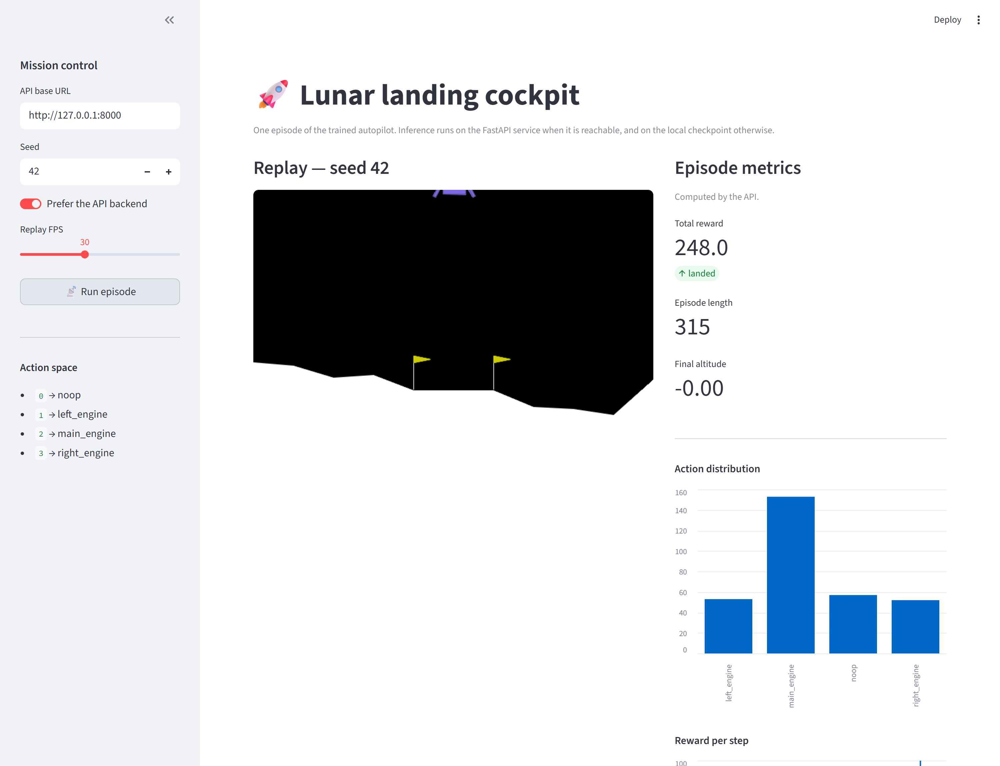
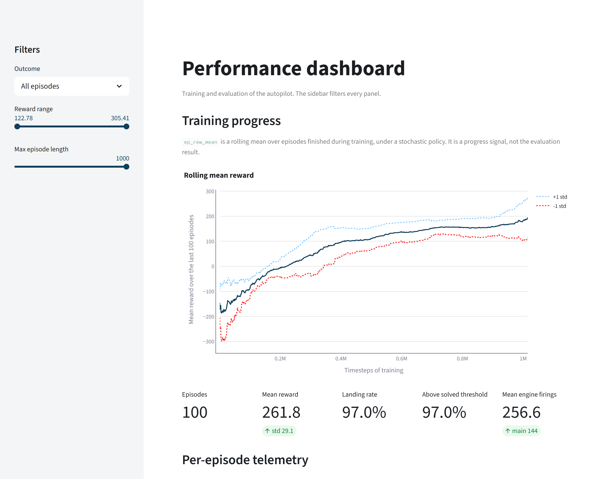

# The two pages

A cockpit that flies one episode, and a dashboard that reads the published evaluation. Both
are Streamlit, both are optional, and neither holds a line of reinforcement learning.
`docs/architecture.md` argues why the boundary sits there; this page says what the two show
and the rules they follow on screen.

```powershell
uv sync --all-extras
uv run streamlit run src/rl_lander/gui.py               # the cockpit
uv run streamlit run src/rl_lander/dashboard.py         # the dashboard
```

The `ui` extra is what installs Streamlit and Plotly. A training and evaluation library has no
reason to pull a web framework into every install, and on Windows the pyarrow that Streamlit
brings faulted when its native libraries loaded after Box2D.

## The cockpit

<!-- source: docs/images/MANIFEST.json -->


| On screen | What it is for |
|---|---|
| The seed box, and the toggle | which episode to fly, and whether to ask the service or the local checkpoint |
| The replay | the animation, rebuilt in the browser from the trajectory that came back |
| Total reward, length, final altitude | the three numbers a flight is judged on |
| Action distribution | how often each engine fired, which is what the reward pays for |
| Reward per step | where in the descent the score was won or lost |

Two rules hold it together. The metrics panel **says which of the two computed it**, because a
number from a service and a number from an in-process model are different claims. And the page
turns red when the local replay and the service's trajectory disagree: the check is
`rl_lander.replay.replay_matches`, and `docs/architecture.md` says what it protects against.

## The dashboard

<!-- source: docs/images/MANIFEST.json -->


| Section | The question it answers |
|---|---|
| Training progress | did the run converge, and when |
| The five cards | episodes, mean reward, landing rate, share above the threshold, mean firings |
| Per-episode telemetry | how the rewards are distributed, and where the lander came to rest |
| Engine use | what a landing costs in firings |

Its inputs are `reports/evaluation_episodes.csv` and `reports/training_curves.csv`, both
tracked, and it recomputes nothing.

## Three rules the pages follow on screen

**An outcome is a word before it is a colour.** `landed` and `did not land` are a text column
and not the integer the environment returns, because Plotly reads an integer as continuous and
paints a gradient over two values.

**A reference is dashed.** On the scatter of resting positions, the band that counts as on
target is drawn in the palette's reserved colour with a dotted line. The dash is what
distinguishes it when the colours are gone.

**Every axis is titled with what it carries.** One `_styled` helper sets the background, the
font, the grid and both titles, from `rl_lander.figure_style`. No chart of either page picks a
colour of its own.

## The theme belongs to the repository

`.streamlit/config.toml` carries the same colours as the figures, and
`tests/unit/test_theme.py` reads it back against the module those figures use. Without that file, Streamlit paints its factory red
on every button and leaves its editor toolbar in the corner of each screenshot.
